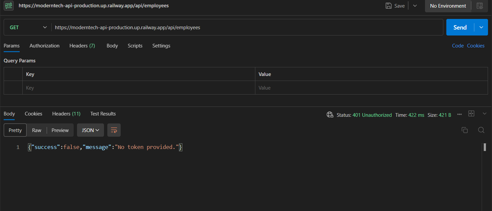
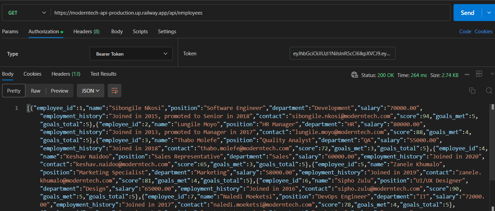
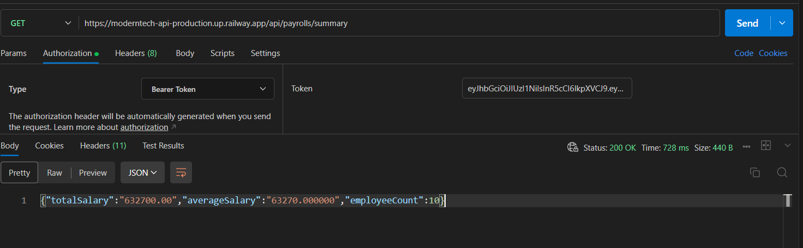
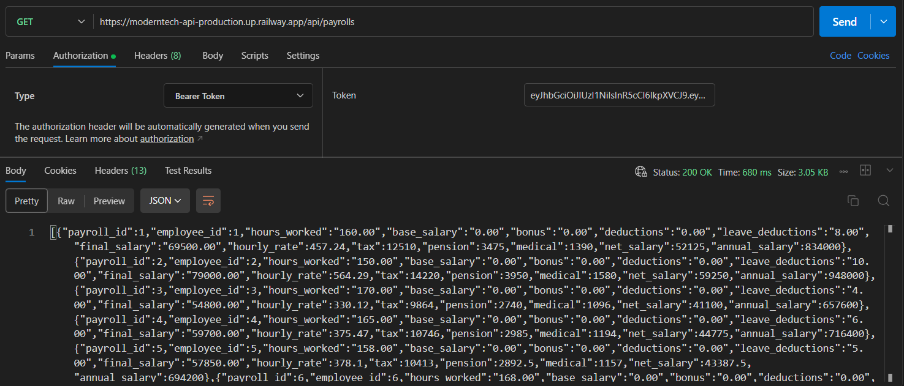
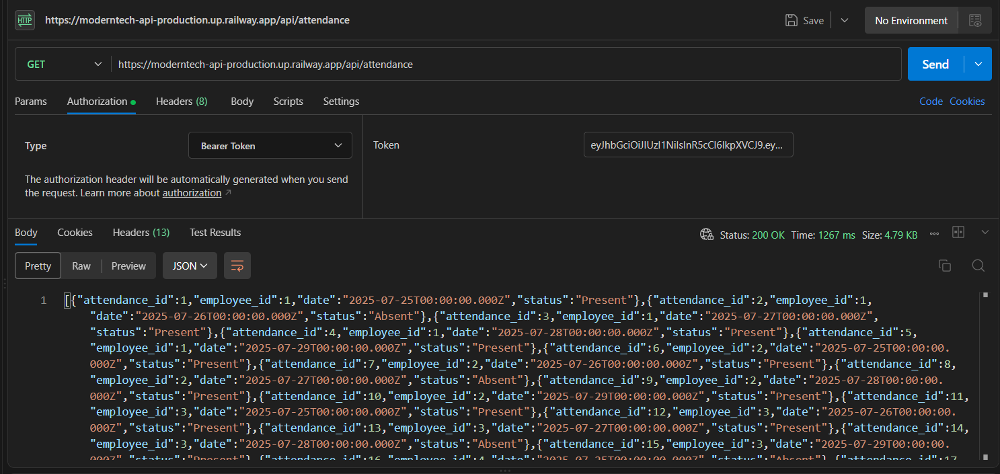

Without a token, the api will return a message of "Unauthorized" with the status code of "401"

With the token, the api will return every employee with the message of "OK" and status code of "200"

With the token, getting payroll summary will return the average payroll for the company

With the token, getting all payroll data

with the token, getting all attendance data
