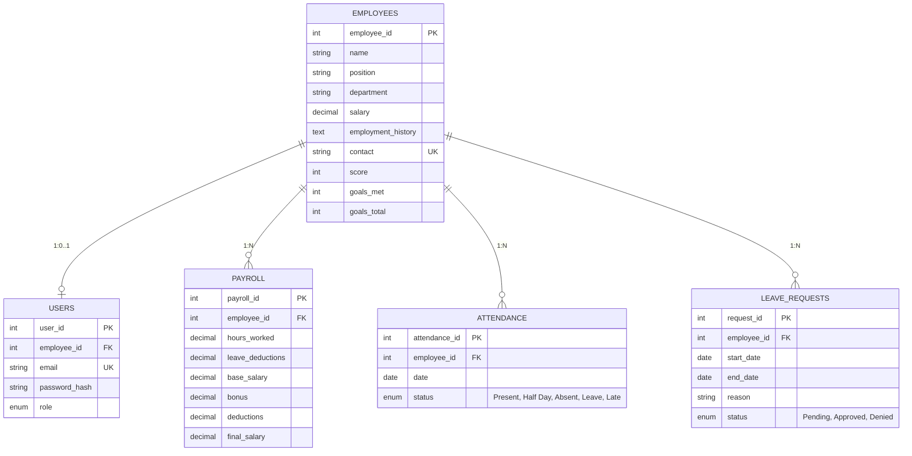

# ModernTech Enterprise Database Documentation

## Overview

The `modern_tech_db` schema serves as the backend database architecture for the ModernTech Human Resources and Payroll Management System. It handles employee management, user authentication with role-based access control, payroll calculations, attendance tracking, and leave request workflows.

---

## Database Architecture & Entity Schema

The database consists of 5 core tables connected via relational foreign keys.

### Entity Relationship Summary

```text
               +-------------------+
               |     EMPLOYEES     |
               +-------------------+
             /      |        |       \
       1:0..1       1:N      1:N     1:N
           /        |        |        \
          v         v        v         v
+-------+   +---------+ +------------+ +----------------+
| USERS |   | PAYROLL | | ATTENDANCE | | LEAVE_REQUESTS |
+-------+   +---------+ +------------+ +----------------+
```

### Mermaid ERD Diagram



---

## Data Dictionary

### 1. `employees`

Stores core profile information, contact details, and performance metrics for company staff.

| Column Name          | Data Type        | Constraints                           | Description                  |
| :------------------- | :--------------- | :------------------------------------ | :--------------------------- |
| `employee_id`        | `INT`            | `PRIMARY KEY, AUTO_INCREMENT`         | Unique ID for each employee  |
| `name`               | `VARCHAR(100)`   | `NOT NULL`                            | Full name                    |
| `position`           | `VARCHAR(100)`   | `NOT NULL`                            | Job title                    |
| `department`         | `VARCHAR(50)`    | `NOT NULL`                            | Department name              |
| `salary`             | `DECIMAL(10, 2)` | `NOT NULL, CHECK (salary >= 0)`       | Base salary                  |
| `employment_history` | `TEXT`           | Optional                              | Career history notes         |
| `contact`            | `VARCHAR(100)`   | `UNIQUE, NOT NULL`                    | Work email address           |
| `score`              | `INT`            | `CHECK (score BETWEEN 0 AND 100)`     | Performance evaluation score |
| `goals_met`          | `INT`            | `DEFAULT 0, CHECK (goals_met >= 0)`   | Completed goals count        |
| `goals_total`        | `INT`            | `DEFAULT 0, CHECK (goals_total >= 0)` | Total target goals count     |

### 2. `users`

Manages application access credentials and role permissions linked to employee profiles.

| Column Name     | Data Type                           | Constraints                                                  | Description               |
| :-------------- | :---------------------------------- | :----------------------------------------------------------- | :------------------------ |
| `user_id`       | `INT`                               | `PRIMARY KEY, AUTO_INCREMENT`                                | Unique user account ID    |
| `employee_id`   | `INT`                               | `FOREIGN KEY -> employees(employee_id) (ON DELETE SET NULL)` | Linked employee ID        |
| `email`         | `VARCHAR(100)`                      | `UNIQUE, NOT NULL`                                           | Login email address       |
| `password_hash` | `VARCHAR(255)`                      | `NOT NULL`                                                   | Encrypted password string |
| `role`          | `ENUM('hr', 'manager', 'employee')` | `NOT NULL, DEFAULT 'employee'`                               | User authorization role   |

### 3. `payroll`

Tracks compensation calculations, hours logged, base salary, bonuses, deductions, and calculated final payouts.

| Column Name        | Data Type        | Constraints                                                 | Description                        |
| :----------------- | :--------------- | :---------------------------------------------------------- | :--------------------------------- |
| `payroll_id`       | `INT`            | `PRIMARY KEY, AUTO_INCREMENT`                               | Unique payroll record ID           |
| `employee_id`      | `INT`            | `FOREIGN KEY -> employees(employee_id) (ON DELETE CASCADE)` | Target employee ID                 |
| `hours_worked`     | `DECIMAL(5, 2)`  | `NOT NULL, CHECK (hours_worked >= 0)`                       | Total hours recorded               |
| `leave_deductions` | `DECIMAL(5, 2)`  | `DEFAULT 0, CHECK (leave_deductions >= 0)`                  | Unpaid leave deduction hours       |
| `base_salary`      | `DECIMAL(10, 2)` | `NOT NULL, CHECK (base_salary >= 0)`                        | Base starting salary               |
| `bonus`            | `DECIMAL(10, 2)` | `NOT NULL, DEFAULT 0, CHECK (bonus >= 0)`                   | Additional bonus payout            |
| `deductions`       | `DECIMAL(10, 2)` | `NOT NULL, DEFAULT 0, CHECK (deductions >= 0)`              | Total deductions applied           |
| `final_salary`     | `DECIMAL(10, 2)` | `NOT NULL, CHECK (final_salary >= 0)`                       | Final net payout amount            |

### 4. `attendance`

Logs daily workforce attendance statuses.

| Column Name     | Data Type                                              | Constraints                                                 | Description                |
| :-------------- | :----------------------------------------------------- | :---------------------------------------------------------- | :------------------------- |
| `attendance_id` | `INT`                                                  | `PRIMARY KEY, AUTO_INCREMENT`                               | Unique attendance entry ID |
| `employee_id`   | `INT`                                                  | `FOREIGN KEY -> employees(employee_id) (ON DELETE CASCADE)` | Target employee ID         |
| `date`          | `DATE`                                                 | `NOT NULL`                                                  | Date of log                |
| `status`        | `ENUM('Present', 'Half Day', 'Absent', 'Leave', 'Late')` | `NOT NULL`                                                  | Daily attendance state     |

> **Table Constraint:** `UNIQUE KEY uq_employee_date (employee_id, date)` prevents duplicate attendance records for an employee on the same calendar date.

### 5. `leave_requests`

Handles leave application submission and date-range approval workflows.

| Column Name   | Data Type                               | Constraints                                                 | Description             |
| :------------ | :-------------------------------------- | :---------------------------------------------------------- | :---------------------- |
| `request_id`  | `INT`                                   | `PRIMARY KEY, AUTO_INCREMENT`                               | Unique leave request ID |
| `employee_id` | `INT`                                   | `FOREIGN KEY -> employees(employee_id) (ON DELETE CASCADE)` | Submitting employee ID  |
| `start_date`  | `DATE`                                  | `NOT NULL`                                                  | Leave start date        |
| `end_date`    | `DATE`                                  | `NOT NULL`                                                  | Leave end date          |
| `reason`      | `VARCHAR(255)`                          | `NOT NULL`                                                  | Reason for request      |
| `status`      | `ENUM('Pending', 'Approved', 'Denied')` | `NOT NULL, DEFAULT 'Pending'`                               | Status of the request   |

---

## Database Views and Performance Optimizations

### 1. Database Indexes

To avoid full table scans and maximize lookup speeds for API queries, non-clustered indexes are created on frequently queried foreign key columns:

- `idx_payroll_employee_id` on `payroll(employee_id)`
- `idx_attendance_employee_id` on `attendance(employee_id)`
- `idx_leave_requests_employee_id` on `leave_requests(employee_id)`

### 2. Aggregate View (`payroll_summary`)

```sql
CREATE OR REPLACE VIEW payroll_summary AS
SELECT
    COUNT(payroll_id) AS total_records,
    SUM(hours_worked) AS total_hours_worked,
    AVG(hours_worked) AS average_hours_worked,
    SUM(leave_deductions) AS total_leave_deductions,
    AVG(leave_deductions) AS average_leave_deductions
FROM payroll;
```

---

## Initial Seed Data Summary

The script populates initial development data into the system:

- **10 Employees:** Across Development, HR, QA, Sales, Marketing, Design, IT, Finance, and Support departments.
- **10 User Accounts:** Configured with roles (`hr`, `manager`, `employee`).
- **10 Payroll Records:** Corresponding to each active employee with base salary, bonuses, and deductions.
- **50 Attendance Records:** Logs tracking 5 workdays per employee across all attendance statuses.
- **13 Leave Requests:** Historical and pending leave request date ranges.

---

## Setup & Execution Instructions

1. Open **MySQL Workbench** or your preferred database GUI client.
2. Execute the `Modern-Tech-Db.sql` script.
3. The database `modern_tech_db` will be created automatically along with all required tables, seed data, indexes, and summary views.